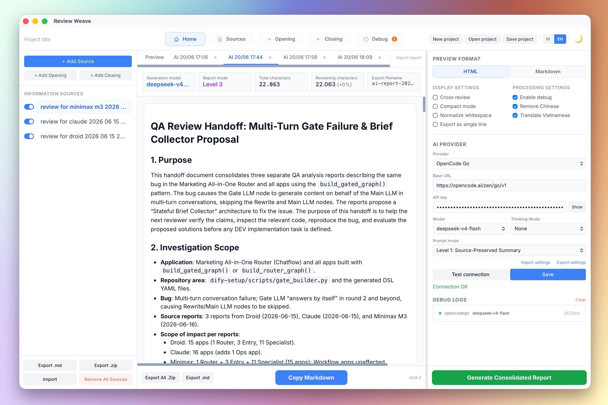

# Review Weave



**Review Weave** is a lightweight desktop application designed to help QA teams and AI models easily cross-review each other's work. It supports AI-powered report consolidation using multiple LLM providers.

## How It Works

When multiple QA teams (or AI models) evaluate the same task, it's helpful to share their reports. However, you don't want a team to see their *own* report in the compiled feedback file.

Review Weave solves this by taking everyone's reports and generating customized files for each team automatically.

**For example, if you have 3 teams (Team A, Team B, Team C):**
- **Team A** receives a file containing reports from Team B & Team C.
- **Team B** receives a file containing reports from Team A & Team C.
- **Team C** receives a file containing reports from Team A & Team B.

## Key Features

- **AI-Powered Report Consolidation**: Automatically rewrite and deduplicate multiple QA reports into a single consolidated report using LLM providers (OpenAI, Anthropic, Gemini, DeepSeek, Xiaomi MiMo, OpenCode Go, Ollama, or any OpenAI-compatible endpoint).
- **Multi-Level Prompt System**: 4 prompt modes — Source-Preserved Summary, Unified Final Report, QA Review Handoff, or fully Custom Prompt.
- **Debug & Log Mode**: Inspect raw AI request/response payloads for troubleshooting provider integrations.
- **Simple Organization**: Neatly organize your information sources, opening notes, and closing notes in the left sidebar.
- **Quick Toggles**: Instantly enable or disable specific reports to include or exclude them from the final export.
- **Live Preview**: See exactly how the Markdown or HTML files will look for each recipient team in real-time.
- **Smart Text Processing**:
  - Automatically removes extra blank lines and trims text (`Normalize Whitespace`).
  - Flattens text into a single continuous line for feeding into LLMs (`Export as Single Line`).
  - Remove Chinese characters and Translate Vietnamese options for AI output post-processing.
- **Import/Export Settings**: Save and restore all app settings (AI config, UI toggles) as JSON files.
- **Bilingual UI**: Full English and Vietnamese language support.
- **Offline & Fast**: Built with Rust and Tauri, meaning it's lightweight, secure, and works entirely offline.

## Prompt Modes

When using AI to generate consolidated reports, you can choose from 4 prompt modes in Settings:

| Mode | Name | Description |
|------|------|-------------|
| **Level 1** | Source-Preserved Summary | Keeps each source report as a separate section. Includes a comparison table. Best when you need to see what each team reported individually. |
| **Level 2** | Unified Final Report | Merges all sources into one deduplicated report with executive summary, findings, recommendations. Best for a single clean output. |
| **Level 3** | QA Review Handoff | Produces a structured handoff document for the next reviewer. Focuses on claims needing verification, files to inspect, and reproduction scenarios. |
| **Level 4** | Custom Prompt | Write your own system prompt. The textarea appears when this level is selected. |

**Default:** Level 2 (Unified Final Report).

Level 1–3 prompts are optimized for specific use cases and cannot be edited. Level 4 lets you fully customize the AI behavior.

## Technology Stack

- **Backend**: Rust (Tauri 2 commands, validation engine, markdown exporter, file packaging)
- **Frontend**: React 19 + TypeScript + Vite 6
- **State Store**: Zustand 5
- **Styling**: Tailwind CSS / Vanilla CSS

## Prerequisites

- [Rust](https://rustup.rs/) (1.70+)
- [Node.js](https://nodejs.org/) (18+)
- [pnpm](https://pnpm.io/) (or npm/yarn)

## Development Guide

```bash
# Install dependencies
pnpm install

# Start the application in development mode
pnpm tauri dev
```

## Production Building & Packaging

```bash
# Build and package for the current platform
pnpm tauri build

# Cross-compilation for specific platforms
pnpm tauri build --target x86_64-unknown-linux-gnu    # Linux
pnpm tauri build --target x86_64-apple-darwin           # macOS Intel
pnpm tauri build --target aarch64-apple-darwin           # macOS Apple Silicon
pnpm tauri build --target x86_64-pc-windows-msvc         # Windows
```

Packaged installers (e.g. `.dmg` or `.app` on macOS, `.exe` or `.msi` on Windows) are written to `src-tauri/target/release/bundle/`.

## Linux Troubleshooting (DMA-BUF Rendering Issue)

If you run or install the application on Linux and it fails to open, crashes, or displays a blank window, this is usually caused by compatibility issues in WebKitGTK's DMA-BUF renderer (hardware acceleration) under certain graphics configurations (especially NVIDIA drivers or newer Intel graphics on Wayland/X11).

To resolve this issue, run the application with the `WEBKIT_DISABLE_DMABUF_RENDERER=1` environment variable to disable DMA-BUF rendering:

```bash
# For installed package (e.g. deb)
WEBKIT_DISABLE_DMABUF_RENDERER=1 review-weaver

# For AppImage
WEBKIT_DISABLE_DMABUF_RENDERER=1 ./Review-Weave.AppImage
```

Alternatively, you can persist this configuration by adding the following line to your shell profile (e.g. `~/.bashrc`, `~/.zshrc`):
```bash
export WEBKIT_DISABLE_DMABUF_RENDERER=1
```

## Cleaning Build Cache & Application Data

Build files can consume significant disk space over time. Run these commands to reset the project and free up space:

```bash
# 1. Clean Rust cargo target build cache (can free up several gigabytes)
cargo clean --manifest-path src-tauri/Cargo.toml

# 2. Clean frontend build output and dev cache
rm -rf dist node_modules/.vite

# 3. Clean application webview data and saved drafts (macOS)
rm -rf ~/Library/WebKit/com.review-weaver.app ~/Library/Caches/com.review-weaver.app
rm -rf ~/Library/WebKit/review-weaver ~/Library/WebKit/qa-review-weaver ~/Library/Caches/review-weaver ~/Library/Caches/qa-review-weaver
```

## Directory Structure

```
src-tauri/
  src/
    main.rs          # Tauri app entrypoint
    lib.rs           # Module declarations
    models.rs        # Data model definitions (Project, QaReport, Component, AI types...)
    validation.rs    # Data validation checks
    export.rs        # Markdown compile & merge logic
    slug.rs          # Unique file slug generator
    zip_export.rs    # ZIP packaging helper
    commands.rs      # IPC command registrations
    ai.rs            # AI provider integration (genai client, rewrite, cancel)
  tauri.conf.json    # Tauri packaging and bundle configurations

src/
  App.tsx                # Main view, resizable sidebar, auto-save & keyboard shortcuts
  main.tsx               # React entrypoint
  index.css              # Custom styling and markdown preview classes
  state/
    projectStore.ts      # Zustand state management (tabs, AI config, content tabs)
  lib/
    api.ts               # Rust command invocations (project + AI IPC)
    i18n.ts              # English/Vietnamese language dictionaries
    sanitize.ts          # API key scrubbing for localStorage
  hooks/
    useToast.ts          # Toast notification system
  components/
    Sidebar.tsx          # Resource lists, active states & quick actions
    EditorPanel.tsx      # Source, opening, and closing content editors
    PreviewBody.tsx      # Live HTML/Markdown preview & stats
    ContentTabs.tsx      # Tab bar for preview + AI-generated reports
    SettingsPanel.tsx    # Settings (preview format, AI provider config, language)
    ToastHost.tsx        # Toast notification renderer
    Toolbar.tsx          # File I/O operations, tab routing & exports
```

## Keyboard Shortcuts

| Shortcut | Description |
|----------|-------------|
| `Ctrl/Cmd + N` | Create New Project |
| `Ctrl/Cmd + S` | Save Project File |
| `Ctrl/Cmd + O` | Open Project File |
| `Ctrl/Cmd + E` | Export All Markdown Files |

## Export Format Specification

The compiled Markdown outputs follow this structural convention:

```markdown
{Active Opening Components Content}

## 1. {Source Name 1}

{Source Content 1}

---

## 2. {Source Name 2}

{Source Content 2}

---

{Active Closing Components Content}
```

## Changelog

### v0.9.0 (2026-06-20)
- **Added**: Custom opening/closing components now included in AI consolidation request body (`build_chat_request`) — user-authored component text is placed before sources (opening) and after sources (closing) with section separators.
- **Added**: Vietnamese prompt enhancement — when translation is enabled, English output-language lines inside the prompt are now replaced with Vietnamese equivalents (beyond just prepending the CRITICAL instruction).
- **Added**: `remove_chinese` critical instruction block appended to AI requests when the setting is active.
- **Added**: Debug logs persistence — debug logs are now automatically saved inside the `.review-weaver.json` project file and fully restored upon opening; new debug tab management (append, close individual, close all) with `DebugLog` reference tracking in project state.
- **Added**: Multi-entry ZIP export (`export_multiple_to_zip`) replacing single-file ZIP — export all AI/preview tabs as a single archive with collision-safe filenames.
- **Added**: Source-level export buttons in sidebar — export the selected source as a standalone `.md` file or all active sources as a `.zip` archive.
- **Added**: Debug log export — export the active debug tab's request/response as a standalone Markdown file.
- **Added**: Loading spinner and overlay components (`LoadingSpinner`, `LoadingOverlay`) extracted and reused across AI request and report-generation views.
- **Added**: `closeAllDebugTabs` action in project store — closes all debug tabs and clears debug logs from project state in one operation.
- **Added**: `ZipEntry` model for Tauri IPC serialization of multi-entry ZIP exports.
- **Added**: i18n keys for new UI strings (`dialog.noSource`, `footer.exportAllZip`, `loading.aiRequest`, `loading.generatingReport`).
- **Fixed**: Source ZIP export (`handleExportSourceZip`) now includes the review-weaver signature — was inconsistent with the `.md` export path which always appended `SIGNATURE`.
- **Fixed**: "Export All ZIP" (`handleExportAllTabsZip`) now regenerates preview content fresh via `generatePreview()` instead of reading the potentially stale cached `previewMarkdown` store value.
- **Fixed**: Debug tab "Close all" button now correctly calls `closeAllDebugTabs` (was incorrectly calling `closeAllAiTabs`).
- **Fixed**: AI tab content now renders `processedContent` via `useMemo` consistently — the raw `tab.markdown` variable was accidentally passed through to `marked.parse` in one code path.
- **Fixed**: `closeAllAiTabs` no longer clears `debug_logs` project state when only AI tabs are being closed.
- **Fixed**: `newProject` no longer redundantly overrides fields that already match `DEFAULT_PROJECT` defaults.
- **Changed**: `build_chat_request` function signature expanded — now accepts `project`, `cfg` parameters; body construction includes opening components, source sections, optional critical instructions, and closing components.
- **Changed**: `get_components` visibility broadened to `pub(crate)`; new `estimate_components_chars` helper added for more accurate capacity estimation in AI requests.
- **Changed**: `export_single_zip` Tauri command replaced by generalized `export_multiple_zip` accepting an array of `ZipEntry` structs.
- **Changed**: Unified `exportTab(mode)` callback replaced by separate named export handlers (`handleExportTabMd`, `handleExportSourceMd`, `handleExportSourceZip`, `handleExportAllTabsZip`, `handleExportDebugLog`) for clearer responsibility boundaries.
- **Changed**: `isValidMarkdownReport` import moved from dynamic (`await import(...)`) to static top-level import.
- **Changed**: Loading overlay DOM inlined in both AI and debug views replaced by shared `LoadingOverlay` component.
- **Removed**: `handleExportMd`/`handleExportZip` export handlers and the underlying `exportTab(mode)` abstraction.
- **Removed**: Dead `displayContent` intermediate variable in `PreviewBody`.
- **Removed**: Verbose explanatory comment and unused variable in Vietnamese prompt test.
- **Tests**: Added `test_resolve_prompt_vietnamese_replaces_english_line` covering all 3 prompt levels.
- **Tests**: Updated test `Project` fixture construction in `ai.rs` and `export.rs` to include new `debug_logs: None` field.
- **Version**: Bumped to 0.9.0 (package.json, Cargo.toml, tauri.conf.json).

### v0.8.2 (2026-06-20)
- **Fixed**: `isValidMarkdownReport` was over-permissive — a bare signature comment or stray `**` passed validation. Replaced with stricter `REVIEW_REPORT_SIGNATURE` regex requiring `## N.` section headers. Split into `isValidSourceDocument` for source document imports (accepts any non-empty text) and `isValidMarkdownReport` for AI report imports (requires Review Weaver report structure).
- **Fixed**: `BINARY_BYTES` regex included `\xFF` (0xFF, matching valid Latin-1 character `ÿ`) — removed to avoid rejecting legitimate international text. Binary check window increased from 1000 to 4096 chars.
- **Fixed**: `handleImportReport` passed `initialCharCount: 0` for imported reports — now passes `content.length` so the "Initial Characters" tile and percent-change badge work correctly.
- **Fixed**: `handleExportSettings` omitted `translate_vietnamese` and `remove_chinese` from the exported settings payload — settings round-trip silently reset both toggles to false.
- **Fixed**: `open_project` legacy validation accepted any JSON with a non-empty `title` field — tightened to require non-empty `qa_reports` or `components`.
- **Fixed**: `import_settings_cmd` legacy validation rejected default settings files (all flags off, no AI config) — now accepts any valid JSON matching the `AppSettings` schema.
- **Fixed**: `PreviewBody` displayed raw (unprocessed) markdown while the "Remaining characters" label and percent-change badge reflected processed content — now renders processed content consistently.
- **Fixed**: `processContent` re-ran on every render in `PreviewBody` and `AiTabContent` — wrapped in `useMemo` with proper dependency arrays.
- **Refactored**: `closeContentTab` dual return path flattened into a single `Partial<ProjectState>` object with conditional `ai_reports` mutation.
- **Removed**: Dead `exportAllMarkdown`/`exportAllZip` Tauri commands, their Rust handlers, TS API wrappers, and the underlying `export_to_zip` function (~80 lines of dead code).
- **Removed**: Excessive explanatory comments in `projectStore.ts` (fenced code block tracking, empty-line stripping, debug view fallback).
- **Tests**: Fixed `Project` test fixture construction in `ai.rs` and `export.rs` to include new `document_type` and `ai_reports` fields.
- **Version**: Bumped to 0.8.2 (package.json, Cargo.toml, tauri.conf.json).

### v0.8.1 (2026-06-19)
- **Fixed**: `isValidMarkdownReport` `BINARY_BYTES` regex was matching the Combining Diacritical Marks Unicode block (U+0300–U+036F) instead of ASCII control bytes — Vietnamese/accented text was being rejected as binary, while real binary content (NUL, etc.) slipped past the check. Now uses proper `[\x00-\x08\x0E-\x1F\x7F\xFF]` escape sequence.
- **Fixed**: `isValidMarkdownReport` `MARKDOWN_STRUCTURE` regex now matches lists at the start of content (added `(^|\n)` anchor) — reports that begin with `- item` were previously rejected.
- **Fixed**: Imported reports no longer show a fake "0% change" percent indicator — `appendAiTab` now passes `initialCharCount: 0` for imports and the "Initial Characters" cell renders `—` when no baseline is available.
- **Fixed**: `setTimeout` in `handleCopy` was leaking on unmount — now stored in `copyTimerRef` and cleared in a `useEffect` cleanup.
- **Refactored**: Extracted `toSlug` helper to `src/lib/slug.ts` and `percentChange` helper to `src/lib/utils.ts` — eliminated triplicated slug logic from `App.tsx`, `Toolbar.tsx`, `SettingsPanel.tsx`, and inline percent calculation from `ContentTabs.tsx`/`PreviewBody.tsx`.
- **Refactored**: Unified `handleExportMd` and `handleExportZip` into a single `exportTab(mode)` callback with `useCallback` wrappers — eliminated ~80 lines of duplicated export logic.
- **Refactored**: Hoisted `BINARY_BYTES` and `MARKDOWN_STRUCTURE` regexes to module scope (no per-call `new RegExp` allocation).
- **Changed**: Renamed `handleExportAllRef` to `handleExportMdRef` in `App.tsx` to match its actual semantics (the ref points only to the MD export, not a combined ZIP+MD action).
- **Changed**: Moved the `import` of `percentChange` to the top of `ContentTabs.tsx` and `PreviewBody.tsx` to satisfy ESM module hoisting conventions.
- **Removed**: Excessive explanatory JSX/TS comments across all components and the project store (~120 lines).
- **Removed**: Whitespace-only changes in `src-tauri/src/commands.rs` (trailing spaces on blank lines).
- **Version**: Bumped to 0.8.1 (package.json, Cargo.toml, tauri.conf.json).

### v0.8.0 (2026-06-19)
- **Feature**: AI report tabs persistence — generated AI reports are now automatically saved inside the `.review-weaver.json` project file and fully restored upon opening.
- **Feature**: "Import report" button — load external Markdown (`.md`) reports directly into new AI tabs from the Home tab bar.
- **Feature**: Validation checks for imports — added validation rule (`isValidMarkdownReport`) to check extension, verify signature, identify legacy exports, and strip binary garbage for both report and source document imports.
- **Feature**: Project and Settings file verification — added JSON signature validation to protect Open Project and Import Settings actions from loading invalid or unrelated files.
- **Fixed**: Target `None` select sources bug in Rust backend — when Cross review is active, generating consolidated reports (with no specific target) now correctly selects all active sources instead of returning an empty list.
- **Changed**: Reorganized settings panel — added horizontal separator and divided options into two distinct columns: `DISPLAY SETTINGS` (Cross review, Compact mode, Normalize whitespace, Export as single line) and `PROCESSING SETTINGS` (Enable debug, Remove Chinese, Translate Vietnamese).
- **Changed**: Formatting scope isolation — `Compact mode`, `Normalize whitespace`, and `Export as single line` options now only affect Copy to clipboard and Export file processes, leaving the on-screen Markdown and HTML views clean.
- **Changed**: Professional save filename convention — default file name generation converts project title to slug format, preserving letters and removing diacritics instead of forcing lowercase.
- **Changed**: Renamed buttons for clarity — changed toolbar options to "New project", "Open project", "Save project", and tab actions to "Close all tabs".
- **Version**: Bumped to 0.8.0.

### v0.7.0 (2026-06-19)
- **Security**: AI response and error messages now scrubbed via `scrub_api_key()` to prevent API key leakage in debug logs
- **Fixed**: `select_sources()` with `exclude_self=true` and no target now correctly returns empty sources (consistent with target-filtered behavior)
- **Fixed**: Keyboard shortcut stale-closure bug — handlers moved to refs (`handleSaveRef`, `handleOpenRef`, `handleExportAllRef`) so keyboard events always read the latest project/validation state
- **Fixed**: AI-generated content in preview tab now applies `processContent()` (whitespace normalization, merge lines) matching clipboard output
- **Fixed**: `handleCancel` now resets `aiBusy` in `finally` block, preventing stuck busy state on cancel failure
- **Fixed**: Tab close navigation — closing a non-active tab now activates the adjacent tab instead of always switching to "preview"
- **Fixed**: `closeAllAiTabs` preserves debug main tab view when debug tabs remain; falls back to "home" otherwise
- **Fixed**: Settings import now triggers `refreshValidation()`, clears API key scrub flag and reload banner
- **Fixed**: Settings model auto-fetch debounced (150ms) to reduce API calls on rapid typing
- **Fixed**: Sidebar file import now triggers `refreshValidation()` after inserting new reports
- **Fixed**: `processContent` paragraph break handling strips leading/trailing empty lines to avoid orphan `|` separators
- **Fixed**: Settings transfer list — "Remove Chinese" and "Translate Vietnamese" labels now use `t()` translation function
- **Changed**: `handleGenerate` uses silent `persistDraft()` instead of `handleSave()` to avoid unnecessary success toast
- **Changed**: Keyboard shortcut `useEffect` dependency narrowed to only `[language]` (handlers now read from refs)
- **Changed**: `AppSettings.translate_vietnamese` and `AppSettings.remove_chinese` made optional
- **Changed**: Removed `translate_vietnamese` and `remove_chinese` from export settings payload (stored in `ai_config`)
- **Refactored**: Extracted `useExportActions` hook — export logic DRYed across Sidebar and ContentTabs
- **Refactored**: Unified `rewrite_for_target` and `rewrite_all` into `run_rewrite`; removed `rewrite_for_target` public function
- **Refactored**: Inlined `estimate_total_chars()` into `run_rewrite`; `build_chat_request()` now takes `system` string directly
- **Refactored**: SettingsPanel — extracted `saveDraft()` for silent save without toast, reused in `handleGenerate`
- **Refactored**: `AiErrorCode` now derives `PartialEq, Eq`
- **Removed**: ~21 unused translation keys (dead code cleanup)
- **Removed**: Excessive doc comments across Rust and TypeScript modules
- **Removed**: Unused `exportAllMarkdown` import from App.tsx
- **Removed**: Unused `info` toast import from Sidebar
- **Version**: Bumped to 0.7.0.

### v0.6.6 (2026-06-18)
- **Feature**: 4-level prompt system — dropdown to select prompt mode:
  - Level 1: Source-Preserved Summary — keeps reports separate with comparison table
  - Level 2: Unified Final Report — merges into one deduplicated report (default)
  - Level 3: QA Review Handoff — structured handoff document for next reviewer
  - Level 4: Custom Prompt — user writes their own prompt (textarea shown)
- **Changed**: `prompt_level` field added to `AiProviderConfig` (Rust + TypeScript)
- **Changed**: `build_chat_request()` selects prompt based on `prompt_level` instead of always using default
- **Changed**: System prompt textarea only visible when Level 4 (Custom Prompt) is selected
- **Changed**: Renamed "Rewrite prompt" label to "Prompt mode" for clarity
- **Changed**: Removed "Max input characters" from UI — internal hard cap raised to 2M chars (~500K tokens)
- **Changed**: Model and Thinking Mode now share the same row (2-column grid layout)
- **Docs**: Added "Prompt Modes" section in README explaining the 4 prompt levels
- **Version**: Bumped to 0.6.6.

### v0.6.5 (2026-06-18)
- **Fixed**: Debug mode now captures actual request/response from real rewrite — replaced fake "ping" test with real `ChatRequest` serialization and response capture via `capture_request_debug()` and `make_debug_log()`.
- **Fixed**: Loading spinner now shows in ContentTabs (both debug and normal view) when `aiBusy` is true, instead of only in the SettingsPanel button.
- **Fixed**: Debug badge moved to right of "Debug" label text in toolbar.
- **Fixed**: `closeAllAiTabs` now preserves debug tabs (only closes AI tabs).
- **Fixed**: Export buttons in Sidebar now check validation state before exporting.
- **Fixed**: `showAiBadge` now checks for AI-kind tabs specifically (`contentTabs.some(t => t.kind === "ai")`) instead of `contentTabs.length > 1`.
- **Fixed**: `processContent` merge mode — improved fenced code block detection with proper opening/closing fence matching (same char, ≥ length, no info string).
- **Fixed**: Export settings reads `translate_vietnamese`/`remove_chinese` from `ai_config` instead of store state.
- **Fixed**: API key visibility (`showApiKey`) resets when switching projects.
- **Changed**: Renamed "Thinking Effort" to "Thinking Mode" with compatibility warning when enabled.
- **Changed**: Replaced manual timestamp calculation in `slug.rs` with `chrono::Local::now()` for proper local timezone support.
- **Removed**: Dead `ai_rewrite_preview` command (unused since v0.6.3).
- **Removed**: Unused `removeEmptyQa` from store, `translateVietnamese`/`removeChinese` store fields (kept as draft state in SettingsPanel only).
- **Chore**: Added `chrono` 0.4 Rust dependency. Cleaned up excessive doc comments across Rust modules.
- **Version**: Bumped to 0.6.5 (package.json, tauri.conf.json, Cargo.toml).

### v0.6.4 (2026-06-18)
- **Feature**: Remove Chinese characters — `strip_chinese()` removes CJK ideographs and CJK punctuation from AI output (toggle: "Remove Chinese").
- **Feature**: Translate Vietnamese — prepends Vietnamese instruction to system prompt so LLM responds in Vietnamese (toggle: "Translate Vietnamese").
- **Feature**: Import/Export Settings — save and restore all app settings (AI config, UI toggles) as JSON files.
- **Feature**: 2-column checkbox layout — reorganized settings toggles: left column (Cross-review, Compact mode, Normalize whitespace, Export as single line), right column (Enable debug, Remove Chinese, Translate Vietnamese).
- **Feature**: Export/Import settings links in SettingsPanel footer (same line as Reset to default).

### v0.6.3 (2026-06-18)
- **Feature**: Xiaomi MiMo provider — native genai adapter with default endpoint `https://api.xiaomimimo.com/v1/`.
- **Feature**: OpenCode Go provider — 16 models, default endpoint `https://opencode.ai/zen/go/v1`.
- **Feature**: Debug/Log mode — `DebugLog` struct, `ai_test_provider_debug` IPC command, Debug main tab with orange badge, clean debug view (no preview header/stats), scrollable debug logs with detail modal.
- **Feature**: Thinking Effort dropdown — None/Low/Medium/High/Max, passed to genai `ReasoningEffort` (OpenAI, Anthropic, Gemini supported; others silently ignored).
- **Feature**: Export filename timestamps — `review-for-{slug}-{YYYYMMDD-HHmmss}.md` with numeric dedup.
- **Feature**: Auto-fetch models on provider change (replaced Detect Models button).
- **Change**: Removed Groq, Cohere, xAI providers. Updated model lists (OpenAI gpt-5.x, Anthropic claude-sonnet/opus-4.x, Gemini 3.x, DeepSeek v4).
- **Change**: OpenAI Compatible — no fallback models, free text input for model name.
- **Change**: Provider dropdown labels capitalized (OpenAI, Anthropic, Xiaomi MiMo, etc.).
- **Fix**: MiMo 404 error — added trailing slash normalization in `build_client()` for correct URL path joining.
- **Fix**: `base_url` and `model` reset when switching provider kind (prevents stale endpoint).
- **UI**: Export/Import moved to left sidebar footer (2×2 grid with Remove All Sources).
- **UI**: Sticky "Generate Consolidated Report" button, stats grid 4-column single row.
- **UI**: Copy Markdown button full-width matching Generate button size.

### v0.6.2 (2026-06-18)
- **Fix**: `toggleQaActive` — undefined `active` now toggles to `true` (was silently `false`).
- **Fix**: "Close All AI Tabs" button shows with 1+ AI tabs (was 2+).
- **Fix**: `processContent` merge mode — regex now requires space after `#` to strip headings.
- **Fix**: `setProject`/`newProject` — reset `validation`, `previewMarkdown`, `aiBusy` on project switch.
- **Fix**: `handleCancel` — added try/catch to prevent `aiBusy` stuck state.
- **Fix**: `parseInt` — added radix 10 parameter.
- **UX**: ContentTabs export buttons — added validation guard (matches keyboard shortcut).
- **UX**: ContentTabs export — show toast on success/error.
- **UX**: Copy button — added clipboard DOM fallback + visual "Copied!" feedback.
- **Efficiency**: Removed redundant `estimate_total_chars` call in rewrite functions.
- **Efficiency**: Use `AiProviderKind.as_str()` instead of Debug format in commands.
- **Dead code**: Removed unused `aiRewritePreview` from `api.ts`.

### v0.6.1 (2026-06-18)
- **Refactor**: Unified content footer for Preview and AI tabs — Export .md | Export .zip | Copy Markdown | Version.
- **Feature**: Import supports multiple .md and .zip files with auto-detection.
- **Feature**: VI/EN language toggle in toolbar (replaced old export buttons).
- **Feature**: `previewMarkdown` state in store for Preview tab copy support.
- **Change**: Default `max_input_chars` raised from 50,000 to 500,000.
- **Change**: Default system prompt shown as placeholder in Rewrite prompt textarea.
- **UI**: Darker background for Sources/Opening/Closing areas.
- **UI**: Export/Import buttons moved to SettingsPanel sidebar.

### v0.6.0 (2026-06-17)
- **Feature**: AI-Powered Report Consolidation — integrates LLM providers (OpenAI, Anthropic, Gemini, Deepseek, Groq, Cohere, xAI, Ollama, and any OpenAI-compatible endpoint) to automatically rewrite and deduplicate multiple QA reports into a single consolidated report.
- **Feature**: AI provider configuration panel — configure provider kind, base URL, API key, model, max input characters, and custom system prompt per project.
- **Feature**: AI connection testing — test provider connectivity and discover available models before saving.
- **Feature**: AI content tabs — generated reports open in dedicated tabs with HTML/Markdown preview, copy-to-clipboard, and tab management (close, close all).
- **Feature**: AI cancel support — cancel in-flight AI requests from the UI with backend CancellationToken integration.
- **Feature**: Toast notification system — non-blocking success/error/info toasts replace `alert()` for AI operations.
- **Feature**: API key security — keys are scrubbed from localStorage auto-save drafts, redacted in Rust Debug output and error messages, with a reload banner reminding users to re-enter.
- **Fix**: `AiErrorCode` serialization mismatch — custom Serialize/Deserialize impls ensure tag strings match TypeScript's string-union type on the wire.
- **Fix**: `cancel_in_flight()` race condition — token is now taken (not borrowed) from the global slot.
- **Fix**: Settings panel draft state sync — `useEffect` resets draft fields when `project.ai_config` changes.
- **Fix**: `handleGenerate` double-click guard — prevents concurrent AI requests.
- **Fix**: QA target dropdown no longer navigates away from Home tab — uses `selectQaOnly()`.
- **Fix**: `max_input_chars` minimum floor raised from 0 to 1.
- **Fix**: `recordScrubIfNeeded` checks original project's API key, not sanitized draft.
- **Fix**: Content tabs WYSIWYG — display applies `processContent()` to match clipboard output.
- **Fix**: Cancellation tests no longer share global `OnceLock` state.
- **Chore**: Removed dead `clear_cancel()` function and `PreviewPanel.tsx`.
- **Chore**: Fixed `.gitignore` typo (`upstrems` → `upstreams`).
- **Tech**: Added `genai` 0.6.5, `tokio`, `tokio-util` Rust dependencies.

### v0.5.6 (2026-06-16)
- **Security**: Narrowed filesystem permission scope from `**` (entire filesystem) to `$HOME/$DESKTOP/$DOCUMENT/$DOWNLOAD`.
- **Fix**: `mergeLines` content processing no longer corrupts fenced code blocks — tracks ` ``` `/`~~~` state and skips heading/rule stripping inside blocks.
- **Fix**: `removeAllQa` now preserves component selection when deleting all QA reports (components are not deleted).
- **Fix**: `migrateProject` uses `maxOrder + 1` instead of hardcoded `0` for migrated component order, preventing order collisions.
- **Fix**: Save/Export dialog filenames now sanitize filesystem-hostile characters (`/`, `:`, `*`, `?`, `<>`, `|`).
- **Fix**: `generate_preview` now checks `target.active` — consistent with `generate_exports` which skips inactive targets.
- **Fix**: `exportAllZip` success alert now shows actual output path returned from backend instead of user-selected input path.
- **Fix**: ZIP export creates missing parent directories and cleans up partial files on error.
- **Fix**: Removed redundant `project.exclude_self` from `refreshPreview` dependency array.
- **Chore**: Removed 6 unused translation keys (`preview.info`, `preview.excluded`, `preview.excludedEnd`, `settings.title`, `settings.removeWhitespaceDesc`, `settings.mergeLinesDesc`).
- **Chore**: Removed redundant JSX comments from EditorPanel.
- **Chore**: Simplified `generate_filename` by removing redundant unnamed-input check in slug module.

### v0.5.5 (2026-06-16)
- **Security**: Enabled Content Security Policy in Tauri config — restricts script/style/connect sources.
- **Fix**: Auto-save draft no longer overwrites loaded project on mount (added `draftLoaded` ref guard).
- **Fix**: `refreshValidation` race condition — stale async IPC responses are now discarded via generation counter.
- **Fix**: Preview panel now refreshes when `exclude_self` toggle changes (missing `useCallback` dependency).
- **Fix**: `marked()` call replaced with `marked.parse()` for reliable synchronous return type.
- **Fix**: `execCommand("copy")` fallback now checks return value and only shows "Copied!" on success.
- **Fix**: `handleExportAll` now shows alert on validation failure, matching Toolbar behavior.
- **Fix**: `removeAllQa` no longer forces tab switch to "opening" — user stays on current tab.
- **Fix**: `compactMode` no longer destroys paragraph breaks needed by `mergeLines` (skip when mergeLines is active).
- **Fix**: `moveComponentUp/Down` sort is now deterministic with `id` tiebreaker for equal-order components.
- **Fix**: `migrateProject` no longer bakes language into component names — uses neutral "Opening"/"Closing".
- **Fix**: Inconsistent spacing in duplicate-name validation warning (`Source # {}` → `Source #{}`).
- **Fix**: Vietnamese slug test strengthened — now asserts diacritics preservation with descriptive error messages.
- **Refactor**: Extracted `SidebarItem`, `CopyIcon`, `DeleteIcon` components — eliminated ~72 lines of triplicated JSX.
- **Chore**: Removed unused `migration.opening` / `migration.closing` translation keys.

### v0.5.4 (2026-06-16)
- **Fix**: Replaced hardcoded text in settings panel title with `t()` translation function.
- **Fix**: Fixed empty-check fallback on copy: if duplicating an unnamed QA, ensure it appends the copy suffix properly (`qa.name ? ... : copySuffix`).
- **Fix**: Simplified state toggles (`active`, `exclude_self`) in project store.
- **Fix**: Added missing `refreshValidation` calls after moving components up or down.
- **Fix**: Refactored component filtering logic in Rust backend.
- **Fix**: Added drag listener cleanup on window unmount to prevent memory leaks.
- **Fix**: Migrated projects now correctly inherit the active store language context.
- **Fix**: Legacy project fields (`opening_text`, `closing_text`) are cleared on migration to prevent redundant serialization.
- **Fix**: Fixed fallback component naming on copy (`comp.name ? ... : copySuffix`).
- **Fix**: Enhanced validation logging by replacing raw IDs with human-readable index labels (e.g. `Source #N`) in the local validation fallback, and log IPC errors.
- **Improvement**: Replaced redundant comments and dead code in state management.
- **Improvement**: Added translation configuration and confirmation alert before removing all QA reports (`removeAllQa`).

### v0.5.3 (2026-06-16)
- **Fix**: `mergeLines` paragraph separator ` | ` never being inserted — the empty-line filter was destroying paragraph break information before the regex could match.
- **Fix**: `removeQa` and `removeEmptyQa` destroying component selection when deleting a non-selected QA report.
- **Fix**: Validation error label showing raw whitespace for whitespace-only QA names instead of `Source #N`.
- **Fix**: Missing `refreshValidation` calls in `updateComponentName` and `addComponent`.
- **Fix**: Removed unreachable dead code in `migrateProject` guard.
- **Fix**: Capped `to_slug` length to 200 characters to prevent exceeding filesystem filename limits.
- **Fix**: Translation fallback operator `||` changed to `??` — empty strings no longer fall through to Vietnamese.
- **Fix**: Added `Array.isArray` validation for localStorage draft to prevent crash on corrupted data.
- **Improvement**: Replaced all hardcoded English/Vietnamese strings with `t()` translation calls.
- **Improvement**: Duplicate suffix now uses `t("suffix.copy", language)` instead of hardcoded Vietnamese `(bản sao)`.

### v0.5.2 (2026-06-16)
- **Security**: Fixed XSS vulnerability — added DOMPurify sanitization for `dangerouslySetInnerHTML` in preview panel.
- **Fix**: JS fallback validation now counts only active reports, matching Rust backend behavior.
- **Fix**: `duplicateQa` now preserves the `active` field from the source QA report.
- **Fix**: `removeComponent` and `duplicateComponent` now trigger validation refresh.
- **Fix**: `migrateProject` now deep-copies the components array to prevent mutation side effects.
- **Fix**: Added error alerts for keyboard shortcuts (Ctrl+S/O/E) matching toolbar button behavior.
- **Fix**: Added `try-catch` around `localStorage.setItem` to handle quota exceeded errors.
- **Fix**: Added `IoError` variant to `ExportError` enum for proper filesystem error categorization.
- **Fix**: ZIP export now uses `IoError` instead of `ValidationFailed` for I/O errors.

### v0.5.1 (2026-06-16)
- **Chore**: Renamed application from "QA Review Weaver" to "Review Weave".
- **Style**: Refined preview panel header element layout and synchronization.
- **Improvement**: Updated translations and set English as the default application language.
- **Chore**: Cleaned up `.gitignore`, untracked cached files.

### v0.5.0 (2026-06-16)
- **Feature**: Implemented resizable right sidebar — drag the left border to adjust preview panel width.
- **Feature**: Added left sidebar toggle for showing/hiding the sidebar.
- **Feature**: Added component actions — duplicate, delete, and reorder (move up/down) for opening/closing sections.
- **Feature**: Default empty state display when no sources or components exist.

### v0.4.0 (2026-06-16)
- **Feature**: Added `exclude_self` cross-review option to filter out the target QA report from its own compiled preview/export.
- **Feature**: Configured blank initial state in Tauri backend — new projects start clean with no demo data.

### v0.3.0 (2026-06-16)
- **Improvement**: Extended project title input area.
- **Feature**: Added HTML/Markdown preview toggle in the preview panel.
- **Fix**: Moved HTML/MD toggle to its own row below the stats grid for better layout.

### v0.2.0 (2026-06-16)
- **Feature**: Major UI/feature refactor — introduced reusable components system (opening/closing sections).
- **Feature**: Added internationalization (Vietnamese/English) with full translation support.
- **Feature**: Added settings panel with compact mode, whitespace normalization, and merge lines options.
- **Improvement**: Tab-based navigation moved to toolbar (Reports, Opening, Closing).
- **Improvement**: Unified sidebar with QA reports and components grouped together.
- **Improvement**: Pill-style tabs design and sidebar badges.

### v0.1.0 (2026-06-15)
- **Release**: Initial release of Review Weave desktop application.
- **Feature**: QA report management with cross-review generation.
- **Feature**: Multi-format exports — Markdown folder and ZIP archiving.
- **Feature**: Text pre-processors — normalize whitespace, export as single line.
- **Feature**: Live Markdown/HTML preview with character and word count.
- **Tech Stack**: Rust (Tauri 2) + React 19 + TypeScript + Zustand 5.

## Roadmap

- [x] **AI-Powered Summarization**: Integrate LLM capabilities to automatically rewrite, refine, or summarize source content.
- [ ] **Source Comparison Tool**: Add a comparison layout to highlight differences and analyze modifications between selected sources.

## License

This project is distributed under the MIT License.
