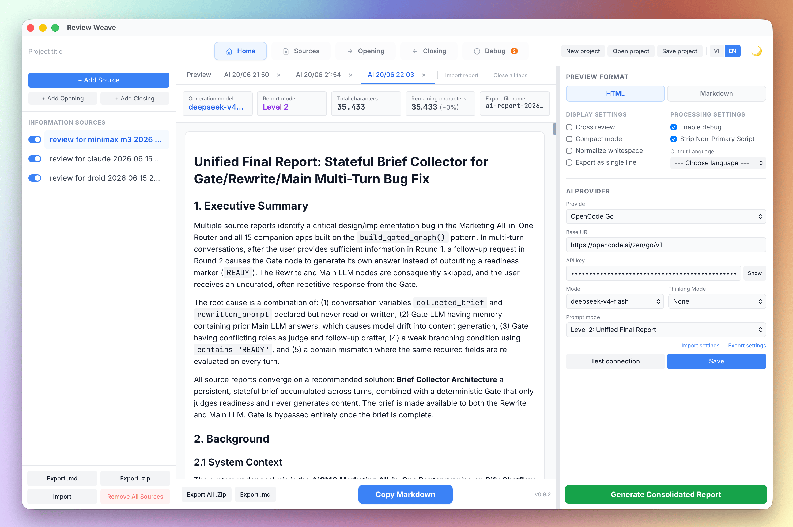

# Cross Review



**Cross Review** is a lightweight desktop application designed to help QA teams and AI models easily cross-review each other's work. It supports AI-powered report consolidation using multiple LLM providers.

## How It Works

When multiple QA teams (or AI models) evaluate the same task, it's helpful to share their reports. However, you don't want a team to see their *own* report in the compiled feedback file.

Cross Review solves this by taking everyone's reports and generating customized files for each team automatically.

**For example, if you have 3 teams (Team A, Team B, Team C):**
- **Team A** receives a file containing reports from Team B & Team C.
- **Team B** receives a file containing reports from Team A & Team C.
- **Team C** receives a file containing reports from Team A & Team B.

## Key Features

- **AI-Powered Report Consolidation**: Automatically rewrite and deduplicate multiple QA reports into a single consolidated report using LLM providers (OpenAI, Anthropic, Gemini, DeepSeek, Xiaomi MiMo, OpenCode Go, Ollama, or any OpenAI-compatible endpoint).
- **Multi-Level Prompt System**: 4 prompt modes — Source-Preserved Summary, Unified Final Report, QA Review Handoff, or fully Custom Prompt.
- **Debug & Log Mode**: Inspect raw AI request/response payloads for troubleshooting provider integrations.
- **Simple Organization**: Neatly organize your information sources, opening notes, and closing notes in the left sidebar.
- **Quick Toggles**: Instantly enable or disable specific reports to include or exclude them from the final export.
- **Live Preview**: See exactly how the Markdown or HTML files will look for each recipient team in real-time.
- **Smart Text Processing**:
  - Automatically removes extra blank lines and trims text (`Normalize Whitespace`).
  - Flattens text into a single continuous line for feeding into LLMs (`Export as Single Line`).
  - Strip Non-Primary Script characters and Output Language options for AI output post-processing.
- **Import/Export Settings**: Save and restore all app settings (AI config, UI toggles) as JSON files.
- **Bilingual UI**: Full English and Vietnamese language support.
- **Offline & Fast**: Built with Rust and Tauri, meaning it's lightweight, secure, and works entirely offline.

## Prompt Modes

When using AI to generate consolidated reports, you can choose from 4 prompt modes in Settings:

| Mode | Name | Description |
|------|------|-------------|
| **Level 1** | Source-Preserved Summary | Keeps each source report as a separate section. Includes a comparison table. Best when you need to see what each team reported individually. |
| **Level 2** | Unified Final Report | Merges all sources into one deduplicated report with executive summary, findings, recommendations. Best for a single clean output. |
| **Level 3** | QA Review Handoff | Produces a structured handoff document for the next reviewer. Focuses on claims needing verification, files to inspect, and reproduction scenarios. |
| **Level 4** | Custom Prompt | Write your own system prompt. The textarea appears when this level is selected. |

**Default:** Level 2 (Unified Final Report).

Level 1–3 prompts are optimized for specific use cases and cannot be edited. Level 4 lets you fully customize the AI behavior.

## Technology Stack

- **Backend**: Rust (Tauri 2 commands, validation engine, markdown exporter, file packaging)
- **Frontend**: React 19 + TypeScript + Vite 6
- **State Store**: Zustand 5
- **Styling**: Tailwind CSS / Vanilla CSS

## Prerequisites

- [Rust](https://rustup.rs/) (1.70+)
- [Node.js](https://nodejs.org/) (18+)
- [pnpm](https://pnpm.io/) (or npm/yarn)

## Development Guide

```bash
# Install dependencies
pnpm install

# Start the application in development mode
pnpm tauri dev
```

## Production Building & Packaging

```bash
# Build and package for the current platform
pnpm tauri build

# Cross-compilation for specific platforms
pnpm tauri build --target x86_64-unknown-linux-gnu       # Linux
pnpm tauri build --target x86_64-apple-darwin            # macOS Intel
pnpm tauri build --target aarch64-apple-darwin           # macOS Apple Silicon
pnpm tauri build --target x86_64-pc-windows-msvc         # Windows
```

Packaged installers (e.g. `.dmg` or `.app` on macOS, `.exe` or `.msi` on Windows) are written to `src-tauri/target/release/bundle/`.

## Linux Troubleshooting (DMA-BUF Rendering Issue)

If you run or install the application on Linux and it fails to open, crashes, or displays a blank window, this is usually caused by compatibility issues in WebKitGTK's DMA-BUF renderer (hardware acceleration) under certain graphics configurations (especially NVIDIA drivers or newer Intel graphics on Wayland/X11).

To resolve this issue, run the application with the `WEBKIT_DISABLE_DMABUF_RENDERER=1` environment variable to disable DMA-BUF rendering:

```bash
# For installed package (e.g. deb)
WEBKIT_DISABLE_DMABUF_RENDERER=1 cross-review

# For AppImage
WEBKIT_DISABLE_DMABUF_RENDERER=1 ./Cross-Review.AppImage
```

Alternatively, you can persist this configuration by adding the following line to your shell profile (e.g. `~/.bashrc`, `~/.zshrc`):
```bash
export WEBKIT_DISABLE_DMABUF_RENDERER=1
```

## Cleaning Build Cache & Application Data

Build files can consume significant disk space over time. Run these commands to reset the project and free up space:

```bash
# 1. Clean Rust cargo target build cache (can free up several gigabytes)
cargo clean --manifest-path src-tauri/Cargo.toml

# 2. Clean frontend build output and dev cache
rm -rf dist node_modules/.vite

# 3. Clean application webview data and saved drafts (macOS)
rm -rf ~/Library/WebKit/com.cross-review.app ~/Library/Caches/com.cross-review.app
rm -rf ~/Library/WebKit/cross-review ~/Library/WebKit/qa-cross-review ~/Library/Caches/cross-review ~/Library/Caches/qa-cross-review
```

## Directory Structure

```
src-tauri/
  src/
    main.rs          # Tauri app entrypoint
    lib.rs           # Module declarations
    models.rs        # Data model definitions (Project, QaReport, Component, AI types...)
    validation.rs    # Data validation checks
    export.rs        # Markdown compile & merge logic
    slug.rs          # Unique file slug generator
    zip_export.rs    # ZIP packaging helper
    commands.rs      # IPC command registrations
    ai.rs            # AI provider integration (genai client, rewrite, cancel)
  tauri.conf.json    # Tauri packaging and bundle configurations

src/
  App.tsx                # Main view, resizable sidebar, auto-save & keyboard shortcuts
  main.tsx               # React entrypoint
  index.css              # Custom styling and markdown preview classes
  state/
    projectStore.ts      # Zustand state management (tabs, AI config, content tabs)
  lib/
    api.ts               # Rust command invocations (project + AI IPC)
    i18n.ts              # English/Vietnamese language dictionaries
    sanitize.ts          # API key scrubbing for localStorage
  hooks/
    useToast.ts          # Toast notification system
  components/
    Sidebar.tsx          # Resource lists, active states & quick actions
    EditorPanel.tsx      # Source, opening, and closing content editors
    PreviewBody.tsx      # Live HTML/Markdown preview & stats
    ContentTabs.tsx      # Tab bar for preview + AI-generated reports
    SettingsPanel.tsx    # Settings (preview format, AI provider config, language)
    ToastHost.tsx        # Toast notification renderer
    Toolbar.tsx          # File I/O operations, tab routing & exports
```

## Keyboard Shortcuts

| Shortcut | Description |
|----------|-------------|
| `Ctrl/Cmd + N` | Create New Project |
| `Ctrl/Cmd + S` | Save Project File |
| `Ctrl/Cmd + O` | Open Project File |
| `Ctrl/Cmd + E` | Export All Markdown Files |

## Export Format Specification

The compiled Markdown outputs follow this structural convention:

```markdown
{Active Opening Components Content}

## 1. {Source Name 1}

{Source Content 1}

---

## 2. {Source Name 2}

{Source Content 2}

---

{Active Closing Components Content}
```


## Changelog

### v0.9.3 (2026-06-20) — Current

- **Rebrand**: Renamed entire project from "Review Weave" to "Cross Review" — package name changed from `review-weaver` to `cross-review`, binary/lib renamed to `cross_review_lib`, app identifier updated to `com.cross-review.app`, and all UI/product references updated accordingly.
- **Changed**: Updated screenshot from `19225.png` to `81905.png`.
- **Changed**: Updated all troubleshooting commands, cleaning paths, and CSP references to use the new `cross-review` binary name and `com.cross-review.app` identifier.
- **Refactored**: Extracted full changelog history from `README.md` into dedicated `CHANGELOG.md` file — README now keeps only the last 2 entries with a link to the full history.
- **Docs**: Updated all code references in `index.html`, tooltips, error messages, and system prompts to reflect the new name.

### v0.9.2 (2026-06-20)

- **Breaking**: Renamed `remove_chinese` to `strip_non_primary` -- now strips all non-primary script characters (CJK, Cyrillic, Arabic, Thai, Devanagari, etc.) via auto-detection instead of only Chinese. Latin characters are always preserved.
- **Breaking**: Renamed `translate_vietnamese` to `output_language` (string) -- supports 14 output languages (vi, en, zh, ja, ko, ru, fr, de, es, pt, it, th, ar, hi) with parameterized CRITICAL instructions. Empty value or "en" means no translation.
- **Changed**: Settings UI now shows a language dropdown (14 options) instead of a Vietnamese checkbox, and a renamed "Strip Non-Primary Script" checkbox.
- **Changed**: `strip_chinese()` replaced with `strip_non_primary_scripts()` using Unicode block auto-detection for primary script identification.
- **Changed**: `prepend_vietnamese_instruction()` replaced with `prepend_language_instruction()` accepting a language code parameter.
- **Changed**: `resolve_prompt()` now handles all 14 output languages with proper prompt sentence replacement and CRITICAL instruction prepending.
- **Changed**: `build_chat_request()` critical instruction broadened from "Do NOT output Chinese" to "Do NOT output any non-primary script characters".
- **Added**: `language_name()` helper mapping language codes to English names.
- **Added**: Comprehensive test coverage for strip_non_primary_scripts (auto-detect Latin primary, Cyrillic primary, mixed CJK-Latin primary, Latin always kept) and output_language (all 14 langs + empty passthrough + English passthrough).
- **Updated**: All i18n keys (`settings.removeChinese` → `settings.stripNonPrimary`, `settings.translateVietnamese` → `settings.outputLanguage` + `settings.outputLanguage.chooseLanguage`).
- **Fixed**: Vietnamese-only error messages in `open_project` and `import_settings_cmd` — now include English fallback for non-Vietnamese users.
- **Fixed**: `refreshValidation` fires an IPC call on every keystroke without debounce — added 200ms debounce timer to coalesce rapid mutations.
- **Fixed**: `listModels` effect re-fetches model list when `draftMaxChars` changes (irrelevant dependency) — removed from dependency array.
- **Fixed**: `migrateProject` creates components without explicit `active` field — now sets `active: true` for consistency with `addComponent`.
- **Refactored**: Removed overly verbose explanatory comments from `strip_non_primary_scripts` and `detect_primary_script`.
- **Refactored**: Removed stale `screenshot-v2.png`, replaced with updated screenshot.

### v0.9.0 (2026-06-20)
- **Added**: Custom opening/closing components now included in AI consolidation request body (`build_chat_request`) — user-authored component text is placed before sources (opening) and after sources (closing) with section separators.
> For the complete version history, see [CHANGELOG.md](./CHANGELOG.md).

## Roadmap

- [x] **AI-Powered Summarization**: Integrate LLM capabilities to automatically rewrite, refine, or summarize source content.
- [ ] **Source Comparison Tool**: Add a comparison layout to highlight differences and analyze modifications between selected sources.

## License

This project is distributed under the MIT License.
